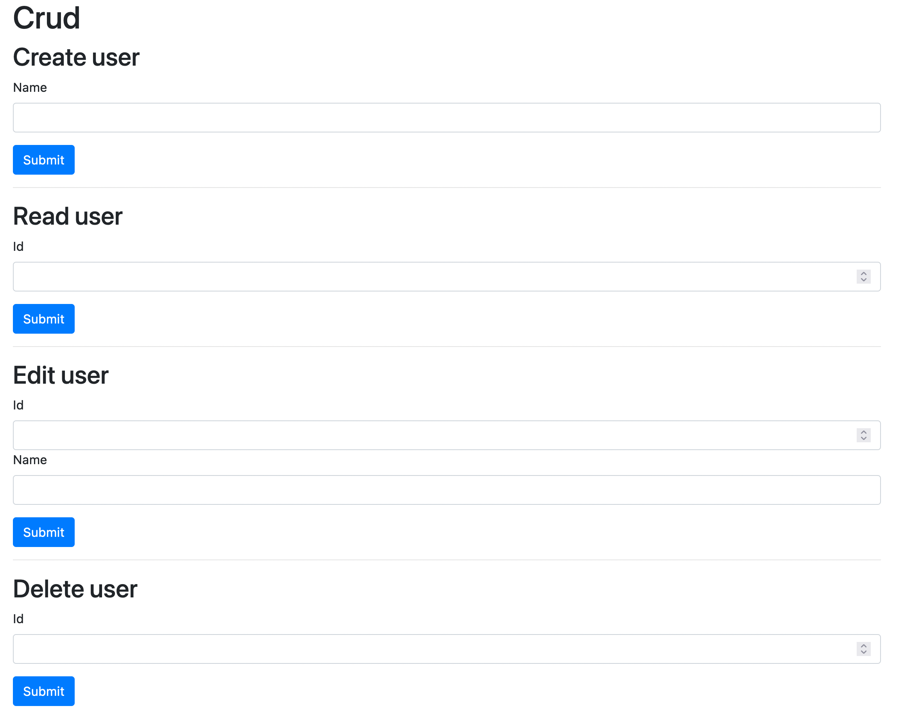

# CRUD

### A simple crud app on the blockchain.

<br />

#### GETTING STARTED
1. Run npm install.
2. To run tests use ```truffle test``` (if you don't have truffle then run ```npm install -g truffle``` to install it).
3.  Enter your project ID from Infura (you'll need an account. Be sure to choose the Ropsten network) and your seed phrase (see below) in a *.secrets* file (copy the .secrets-example for a template).
4. Run truffle develop to generate a seed phrase/addresses. In that develop terminal run ```migrate --reset --network ropsten``` to run your migrations and build/deploy your project. Be sure to have some test ether in order to deploy and make transactions.
5. Run ```npm run start``` to run app. You can Create, Read, Update, and Delete users on the Ropsten network using the Metamask wallet and the Ropsten network.

<br />

Obviously functionality is the focus here, not style 🤪

<br />


